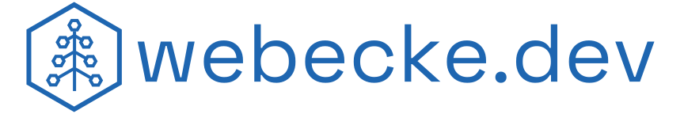

# Dallin Webecke
### _Software Engineer_

Well hello there 👋

I'm an emerging software engineer focused on developing detailed and reliable software to simplify and solve everyday 
problems. Currently finishing up my CS degree at BYU where I work as a TA helping students master coding concepts, and 
develop a product to evaluate their work. Thus far, I specialize in TypeScript and Java, though I'm always looking to 
learn new languages and technologies. 

# Projects

## The Autograder 

_The Autograder_ is a system developed by me and other CS 240 TAs to grade the work of students taking BYU's Advanced 
Software Construction Course. It greatly reduces help-wait time by reducing in-person pass-offs, and eliminating manual 
grading. It is currently in use to grade the work of 400+ students every semester.

### Key Contributions

- Streamlined student user experience by simplifying their interface and refactoring ineffective systems.
- Developed configuration system to allow administrators to change previously hard-coded values.
- Created tools to allow administrators to view student and submission details.

**Repository:** https://github.com/softwareconstruction240/autograder

**Live Version:** https://cs240.click

## JolleyBites - _Recipe Cost Calculator_

_JolleyBites_ is my attempt to solve a problem my mom has with her baking business: how much do different recipes 
actually cost to make? Originally I built a Google Sheet to solve the problem, but I recently decided to build an
application to solve her problem in a more modern and user-friendly way.

**Repository:** https://github.com/webecke/JolleyBites

**Live Version [Though very much in development]:** https://jolleybites.webecke.dev

## LakeStats

_LakeStats_ is my alternative to other websites that exist that provide data to the public about lakes in the southwest. 
The goal is to provide a service that loads faster, is simpler, and easier to use than existing services. Also, it's an 
excuse to learn new technologies like Java Spring and React. Originally I was building it for Lake Powell only, but
soon discovered how easy it would be to expand to other lakes. Thus, LakeStats!

**Repository:** https://github.com/webecke/LakeStats

**Live Version:** None yet - still really early development

# Contact
If you want to get in contact, feel free to email me: me@webecke.dev

My personal website (though currently just a landing page) is https://webecke.dev

I have a LinkedIn profile if that's something you need: https://linkedin.com/in/dallin-webecke

  

